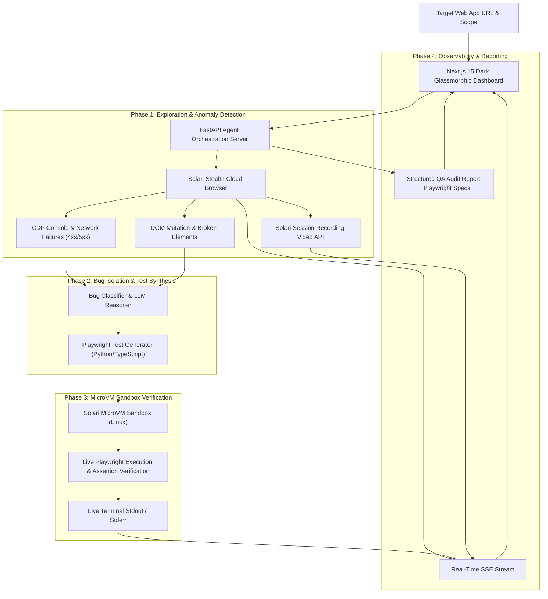

# BugScout AI — Autonomous Self-Healing QA & Bug Discovery Agent

> An enterprise-grade autonomous QA & visual regression agent powered by **Solari Cloud Infrastructure** (Stealth Browsers, MicroVM Sandboxes, and Session Recordings).

---

## ⚡ Why Solari?

Building an autonomous QA agent requires more than just calling an LLM:

1. **Anti-Bot Stealth Egress**: Modern web applications run Cloudflare/DataDome firewalls. Solari's **Cloud Browsers** provide built-in residential proxies and humanized cursor trajectories that navigate real user flows without getting blocked.
2. **Sub-Second MicroVMs**: When BugScout detects a runtime JavaScript error, network 500 failure, or broken DOM anomaly, it synthesizes a standalone **Playwright test script** and provisions an isolated Linux **MicroVM Sandbox** in `<500ms` to execute and verify the reproduction suite live.
3. **Session Video Replay**: Solari's session recording API captures full video replays of the discovered bug for instant developer triage.

---

## 🏗️ Architecture



---

## 🚀 Quickstart

### Prerequisites
- Python 3.13+ (`uv` or `python3`)
- Node.js 20+ & npm
- A Solari API Key from [console.getsolari.com](https://console.getsolari.com)

### 1. Backend Setup

```bash
cd examples/bugscout/backend

# Configure environment
cp .env.example .env
# Add your SOLARI_API_KEY and optional GEMINI_API_KEY to .env

# Run unit tests
python3 -m pytest tests -v

# Start FastAPI backend server
uvicorn app.main:app --port 8000 --host 0.0.0.0
```

### 2. Frontend Setup

```bash
cd examples/bugscout/frontend

# Install and start Next.js dashboard
npm install
npm run dev -- -p 3000
```

Open [http://localhost:3000](http://localhost:3000) in your browser.

---

## 🧪 What BugScout Tests & Catches

- **Runtime JavaScript Exceptions**: `TypeError`, `ReferenceError`, unhandled promise rejections via Chrome DevTools Protocol.
- **Network Failures**: `404 Not Found`, `500 Internal Server Error`, CORS missing header failures, API timeouts.
- **Broken Assets**: Missing font files, broken `` tags, empty `href` anchor elements.
- **Form Security & Validation**: Missing CSRF tokens, unvalidated inputs, dead-end submission workflows.
- **Playwright Test Synthesis**: Generates executable `@playwright/test` (TypeScript) and `pytest-playwright` (Python) code.
- **MicroVM Verification**: Runs the synthesized tests in isolated Solari MicroVMs to guarantee 100% determinism before creating bug tickets.

---

## 📄 License

MIT © 2026 Solari Cookbook Contributors.
