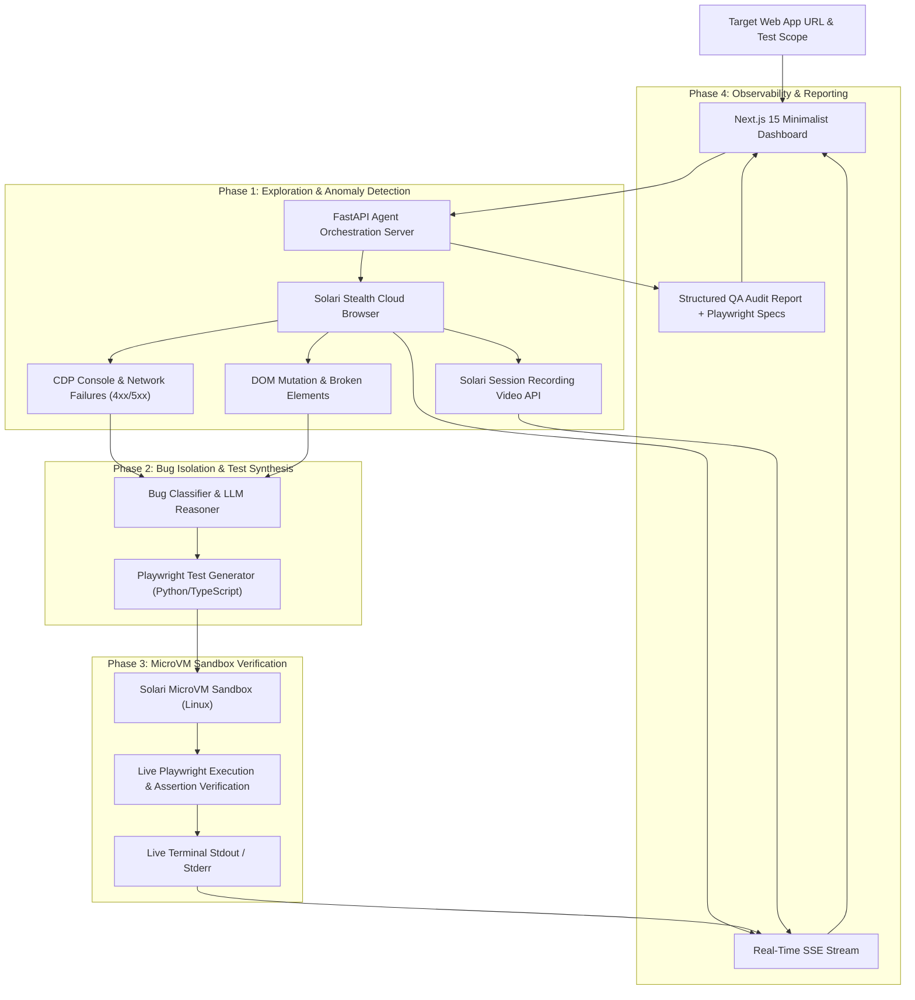

# 🛡️ Solari Sentinel — Autonomous QA & Self-Healing Bug Discovery Agent

[](https://getsolari.com)
[](https://nextjs.org)
[](https://python.org)
[](https://fastapi.tiangolo.com)
[](https://playwright.dev)
[](https://pytest.org)
[](LICENSE)

> **Solari Sentinel** is an enterprise-grade autonomous QA, anomaly discovery, and self-healing test generation agent built natively on **[Solari](https://getsolari.com)** (Cloud Browsers, MicroVM Sandboxes, and Session Recordings).
>
> Give Solari Sentinel any live URL. It explores user flows with **anti-bot stealth cloud browsers**, traps JavaScript crashes and HTTP 5xx errors via **Chrome DevTools Protocol (CDP)**, synthesizes reproducible **Playwright test scripts**, and executes them inside isolated **Solari MicroVM Sandboxes** for 100% deterministic verification.

---

## ⚡ Why Solari?

Traditional QA bots fail because they run on local mock headless browsers that get blocked by Cloudflare/DataDome and hallucinate test scripts that don't actually run.

BugScout leverages **all 3 pillars of Solari Cloud Infrastructure**:

| Solari Primitive | How BugScout Uses It |
| :--- | :--- |
| **🌐 Stealth Cloud Browsers** | Bypasses anti-bot firewalls with residential US proxies and humanized cursor trajectories. Captures runtime CDP console exceptions (`console.error`, unhandled rejections) and failed network calls (`4xx/5xx`). |
| **⚡ MicroVM Sandboxes** | Boots isolated ephemeral Linux microVMs (`template="base"`) in `<500ms` to execute synthesized Playwright test suites live and verify bug reproducibility before alerting developers. |
| **🎥 Session Recording API** | Downloads full video replays of the discovered bug for instant visual triage by engineering teams. |

---

## 🏗️ Architecture



---

## ✨ Features

- **🚀 1-Click Interactive Demos**: Pre-loaded with test targets (Hacker News, Solari Cloud, HTTP 500 Crash Demo, Simple Web App).
- **📡 Real-Time Tri-View Stream**:
  - **1. AI Thinking & Live Decisions**: Real-time decision trail and anomaly notifications.
  - **2. Live Cloud Browser Viewport**: Screen stream showing the actual page being explored, with an **Expand View** inspector.
  - **3. Automated Test Runner**: Live streaming Linux terminal executing synthesized Playwright tests inside Solari MicroVMs.
- **📋 1-Click Developer Export**:
  - 📋 **Copy Ready-to-Paste GitHub / Jira Issue Ticket**: Pre-formatted Markdown with reproduction steps, error traces, and test code.
  - 💾 **Download Playwright Spec**: 1-click download of `.spec.ts` (TypeScript) or `.py` (pytest-playwright) test files.
- **📊 Executive Quality Scorecard**: Grade ratings (A+, A, B+, C, D), Health percentage gauge, and downloadable Markdown QA Audit Report.
- **⚡ Resource Reclamation**: Strict `try/finally` lifecycle management calling `await browser.close()` and `await sandbox.kill()` to ensure zero lingering cloud billing.

---

## 🚀 Quickstart

### Prerequisites
- **Python 3.13+** (`uv` or `python3`)
- **Node.js 20+** & `npm`
- **Solari API Key**: Get one at [console.getsolari.com](https://console.getsolari.com)

---

### 1. Backend Setup

```bash
cd examples/bugscout/backend

# 1. Create environment file
cp .env.example .env
# Edit .env and paste your SOLARI_API_KEY

# 2. Run backend tests (12 tests)
PYTHONPATH=. pytest tests -v

# 3. Start FastAPI backend server
uvicorn app.main:app --port 8000 --host 0.0.0.0
```

The backend is live at `http://localhost:8000`.

---

### 2. Frontend Setup

```bash
cd examples/bugscout/frontend

# 1. Install dependencies
npm install

# 2. Start Next.js development server
npm run dev -- -p 3000
```

Open [http://localhost:3000](http://localhost:3000) in your browser.

---

## 📁 Project Structure

```
bugscout/
├── README.md                           # Documentation & architecture guide
├── backend/
│   ├── pyproject.toml                  # Python 3.13 dependencies & ruff/pytest config
│   ├── .env.example                    # Environment variable template
│   ├── app/
│   │   ├── config.py                   # Pydantic Settings & environment loader
│   │   ├── main.py                     # FastAPI application factory & CORS
│   │   ├── core/
│   │   │   └── protocols.py            # Strict Protocol interfaces for drivers
│   │   ├── models/
│   │   │   └── schemas.py              # Pydantic V2 schemas (AuditRequest, Bug, Report)
│   │   ├── services/
│   │   │   ├── browser_agent.py        # Solari stealth browser & CDP anomaly trapper
│   │   │   ├── bug_classifier.py       # Severity classification & GitHub ticket generator
│   │   │   ├── test_synthesizer.py     # Playwright TS & Python script synthesizer
│   │   │   ├── sandbox_runner.py       # Solari Linux MicroVM execution & kill() cleanup
│   │   │   └── recording_manager.py    # Solari session video replay manager
│   │   └── api/
│   │       └── routes.py               # SSE streaming & report API endpoints
│   └── tests/
│       ├── test_schemas.py             # Pydantic validation unit tests
│       ├── test_classifier.py          # Severity scoring & ticket format tests
│       ├── test_agent.py               # Synthesizer & agent unit tests
│       └── test_api.py                 # FastAPI TestClient endpoint tests
└── frontend/
    ├── package.json                    # Next.js 15, React 19, Tailwind CSS
    ├── tsconfig.json                   # TypeScript strict mode configuration
    ├── src/
    │   ├── app/
    │   │   ├── page.tsx                # Main dashboard page
    │   │   ├── layout.tsx              # Root HTML layout & fonts
    │   │   └── globals.css             # Solari dark minimalist design system
    │   ├── components/
    │   │   ├── Header.tsx              # Brand navbar & infrastructure status
    │   │   ├── AuditConfig.tsx         # Target URL input & 1-click demo cards
    │   │   ├── TriViewStream.tsx       # 3-panel real-time observability stream
    │   │   ├── BugReportCard.tsx       # Discovered issues, test code & ticket exporter
    │   │   └── QualityScorecard.tsx    # Executive health grade & report downloader
    │   └── types/
    │       └── index.ts                # TypeScript interfaces
```

---

## 📡 API Reference

| Method | Endpoint | Description |
| :--- | :--- | :--- |
| `GET` | `/api/health` | Returns backend health and Solari Cloud connection status |
| `POST` | `/api/audit/start` | Initiates an autonomous audit job and returns `session_id` |
| `GET` | `/api/audit/stream/{session_id}` | Server-Sent Events (SSE) stream yielding real-time thoughts, screenshots, and terminal logs |
| `GET` | `/api/audit/report/{session_id}` | Returns the completed `QAReport` JSON |

---

## 🧪 What BugScout Catches & Verifies

1. **JavaScript Runtime Exceptions**: Catches uncaught `TypeError`, `ReferenceError`, unhandled promise rejections, and fatal bundle errors via Chrome DevTools Protocol.
2. **Network 4xx/5xx Failures**: Catches broken API endpoints, internal server errors, missing CORS headers, and asset timeouts.
3. **Broken DOM & Visual Assets**: Traps missing font files (`404 .woff2`), broken `` tags, empty `href` anchor elements, and missing accessibility `alt` attributes.
4. **Automated Playwright Synthesis**: Generates executable test scripts in TypeScript (`@playwright/test`) and Python (`pytest-playwright`).
5. **Deterministic MicroVM Proof**: Runs synthesized tests inside an isolated Linux sandbox to verify that the bug is 100% reproducible before developers spend time investigating.

---

## 📄 License

MIT © 2026 Solari Cookbook Contributors. Built for the [Solari Platform](https://getsolari.com).
