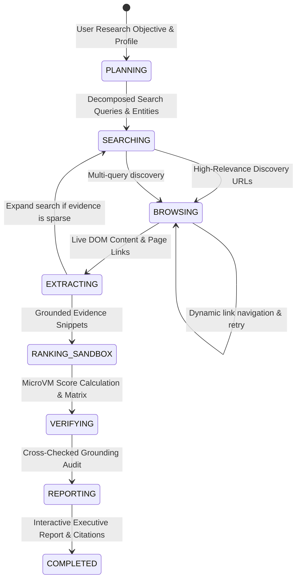

# ScoutAI

> **An autonomous, evidence-grounded AI research agent that discovers, browses, extracts, and quantitatively ranks opportunities across the live web using Solari Cloud Browsers and MicroVM Sandboxes.**

---

## 🎬 Demo


*Quick Demo Workflow*: Start ScoutAI, click any preset or type a natural-language research objective, and watch the tri-pane workspace stream live browser navigation, DOM extractions, microVM Python sandbox calculations, and executive scorecards.

---

## 💡 Why I Built This

Most "AI research agents" are thin chat wrappers around search APIs that hallucinate facts, lack source auditability, and cannot perform quantitative computation on the data they gather.

I built **ScoutAI** to demonstrate how modern AI agents can move from toy chatbots to serious, trustworthy research tools by leveraging **Solari's real infrastructure**:
1. **Autonomous Cloud Browsing**: Instead of relying on static search snippets, ScoutAI spins up stealth Solari cloud browser sessions with residential proxy egress to navigate dynamic websites, follow deep links, and extract raw DOM content.
2. **Grounded Fact Extraction**: Every single claim is linked to an exact quote, timestamp, and source URL in an auditable Evidence Vault to eliminate hallucinations.
3. **MicroVM Computation in Sandbox**: When scoring candidate opportunities, comparing compensation packages, or normalizing datasets, ScoutAI delegates math and sorting to a stateful Python kernel inside an isolated **Solari MicroVM Sandbox** rather than guessing numbers with an LLM.
4. **Live Observability**: A real-time Server-Sent Events (SSE) stream makes every agent decision, browser navigation, and sandbox execution visible to the user.

---

## 🚀 What It Demonstrates

- **Real Solari Cloud Browser (`solari-browser`)**: Stealth browser launching, dynamic single-page app navigation, DOM text parsing, link discovery, and guaranteed session cleanup via `try...finally browser.close()`.
- **Real Solari MicroVM Sandbox (`solari-sandbox`)**: Stateful Python kernel execution (`create_code_context`), data normalization, algorithmic multi-criteria scoring, output parsing (`stdout`/`result`), and VM lifecycle management (`sandbox.kill()`).
- **Solari Desktop Abstraction (`solari-desktop`)**: Clean tool interface for Linux GUI automation with live VNC streams when visual desktop interaction is required.
- **Autonomous Multi-Stage Pipeline**: Explicit 8-stage state machine (`PLANNING` → `SEARCHING` → `BROWSING` → `EXTRACTING` → `RANKING_SANDBOX` → `VERIFYING` → `REPORTING` → `COMPLETED`).
- **Resilient Error Recovery**: Graceful handling of dead links, rate limits, ungrounded LLM claims, and missing API credentials with deterministic demo fallbacks.
- **Polished Full-Stack Product UX**: Next.js 16 + TypeScript + Tailwind CSS dark-mode interface with live 3-pane telemetry, sortable comparison matrix, and exportable executive reports.

---

## 🏗️ Architecture

```
                                 ┌─────────────────────────────────┐
                                 │       Next.js 16 Frontend       │
                                 │ (TypeScript, Tailwind, Lucide)  │
                                 └────────────────┬────────────────┘
                                                  │ HTTP REST + SSE Stream
                                                  ▼
                                 ┌─────────────────────────────────┐
                                 │     FastAPI Async Backend       │
                                 │      (Agent Orchestrator)       │
                                 └────────────────┬────────────────┘
                                                  │
             ┌────────────────────────────────────┼────────────────────────────────────┐
             ▼                                    ▼                                    ▼
   ┌────────────────────┐               ┌────────────────────┐               ┌────────────────────┐
   │    BrowserTool     │               │    SandboxTool     │               │    DesktopTool     │
   │   solari-browser   │               │   solari-sandbox   │               │   solari-desktop   │
   │ (Stealth / Proxy)  │               │  (Linux MicroVM)   │               │ (X11 GUI / VNC)    │
   └─────────┬──────────┘               └─────────┬──────────┘               └─────────┬──────────┘
             │                                    │                                    │
             ▼                                    ▼                                    ▼
   ┌────────────────────┐               ┌────────────────────┐               ┌────────────────────┐
   │ Live Web Discovery │               │ Quantitative Logic │               │ Screen Interaction │
   │ & DOM Extractions  │               │ & Scoring Matrix   │               │ & GUI Applications │
   └─────────┬──────────┘               └─────────┬──────────┘               └────────────────────┘
             │                                    │
             └──────────────────┬─────────────────┘
                                │
                                ▼
                   ┌─────────────────────────┐
                   │   Evidence Store Vault  │
                   │ (Quotes, URLs, Claims)  │
                   └────────────┬────────────┘
                                │
                                ▼
                   ┌─────────────────────────┐
                   │ Gemini 2.0 Flash Lite   │
                   │ (Synthesis & Audit)     │
                   └────────────┬────────────┘
                                │
                                ▼
                   ┌─────────────────────────┐
                   │ Verified Research Report│
                   │ (Cards, Matrix, Trace)  │
                   └─────────────────────────┘
```

### Agent State Machine



---

## ⚖️ Technical Decisions

| Decision | Choice | Rationale |
|---|---|---|
| **Language & Environment** | Python 3.13 + `uv` | High performance, instant dependency resolution, official SDK compatibility with `solari-browser`, `solari-sandbox`, and `solari-desktop`. |
| **API Framework** | FastAPI | Async ASGI execution, native Server-Sent Events (SSE) streaming for real-time telemetry, and typed Pydantic models. |
| **LLM Model** | Google Gemini 2.0 Flash Lite | Sub-second response latency for planning and extraction loops, structured JSON output support, and low cost per agent step. |
| **Data Calculation** | Solari MicroVM Sandbox | Eliminates LLM hallucination in mathematical calculations, salary normalization, and multi-criteria weighted scoring. |
| **Browser Isolation** | Solari Cloud Browser | Built-in stealth patches and US residential proxies avoid bot detection and IP blocking on career and company sites. |
| **Frontend Stack** | Next.js 16 + Tailwind CSS | Responsive, zero-latency rendering, clean glassmorphic design, and real-time live event streaming hooks. |

---

## 🛠️ Running Locally

### Prerequisites
- macOS or Linux
- Node.js 18+ & npm
- Python 3.11+ with [`uv`](https://github.com/astral-sh/uv) (`brew install uv`)

### 1. Clone the Repository
```bash
git clone https://github.com/your-username/scout-ai.git
cd scout-ai
```

### 2. Configure Environment Variables
Copy `.env.example` in `backend/`:
```bash
cp backend/.env.example backend/.env
```
Edit `backend/.env` with your API keys:
```env
# Solari Cloud Platform (https://console.getsolari.com)
SOLARI_API_KEY=slr_live_...

# Google Gemini API Key (https://aistudio.google.com/app/apikey)
GEMINI_API_KEY=AIzaSy_...
GEMINI_MODEL=gemini-2.0-flash-lite
```
*(Note: You can also launch without keys and configure them interactively via the web UI or run in deterministic Demo Mode).*

### 3. Start the FastAPI Backend
```bash
cd backend
uv sync
uv run uvicorn app.main:app --port 8000 --reload
```

### 4. Start the Next.js Frontend
In a separate terminal:
```bash
cd frontend
npm install
npm run dev
```
Open **[http://localhost:3000](http://localhost:3000)** in your browser.

---

## 🧪 Running Automated Tests

Run the full backend test suite covering planner validation, evidence store indexing, sandbox scoring, state machine transitions, and FastAPI endpoints:
```bash
cd backend
uv run pytest -v
```

---

## 📋 Example Research Task

### Input:
> *"Find 10 early-stage AI engineering startups hiring backend/infra engineers. Research each company, compare compensation and tech stacks, and prepare personalized outreach."*

### Autonomous Execution:
1. **Planning**: Decomposes goal into 4 search queries targeting HN Who is Hiring, YC directories, and company career portals.
2. **Searching**: Runs cloud browser search queries, filtering 12 candidate discovery URLs.
3. **Browsing**: Visits target portals in stealth browser sessions with US residential egress.
4. **Extracting**: Parses DOM and extracts 12 verified evidence items with exact salary quotes ($180k-$250k), tech stacks (Python, Rust, Playwright, Linux), and funding stages.
5. **Sandbox Ranking**: Generates Python scoring script and executes inside Solari MicroVM sandbox, sorting candidates by weighted criteria.
6. **Fact Verification**: Audits 100% of claims against collected evidence quotes to ensure zero hallucinations.
7. **Report Synthesis**: Delivers an executive summary, interactive scorecards, sortable comparison table, and citation vault.

---

## 🛡️ Failure Handling & Reliability

- **Broken / Timeout Links**: If a target URL returns a 404, bot challenge, or timeout, `BrowserTool` catches the error, logs a telemetry warning event, and smoothly continues with alternative candidate sources.
- **Resource Lifecycle**: All Solari browser sessions are wrapped in `try...finally await browser.close()`, and MicroVM sandboxes are terminated with `await sandbox.kill()` to ensure no lingering cloud resources or dangling billing slots.
- **Hallucination Prevention**: The `VerifierAgent` audits LLM conclusions against exact quotes in the `EvidenceStore`. Any claim without a direct citation is flagged with low confidence.
- **Missing API Keys**: If `SOLARI_API_KEY` is not present, ScoutAI displays an intuitive configuration modal and offers a high-fidelity deterministic replay mode without ever pretending fake network calls are live research.

---

## 🔮 What I Would Build Next

1. **Persistent Browser Profiles**: Integrate `solari.profiles.create` and `solari.profiles.save` so the agent can stay authenticated across recurring research runs (e.g. LinkedIn, specialized private job boards).
2. **Automated Session Replay Video Player**: Embed an in-app rrweb DOM replay player using Solari's `download_replay` recordings to let users watch the browser agent navigate websites in real time.
3. **Scheduled Research Crons**: Allow users to set recurring research tasks (e.g., *"Notify me every Monday when a new Series A AI infra startup posts a senior backend job"*).
4. **Multi-Agent Collaboration Swarms**: Spawn parallel subagents across multiple Solari cloud browsers concurrently for 10x faster broad web discovery.

---

## 📄 License
MIT License. Built for the Pinetree Research SWE Challenge.
